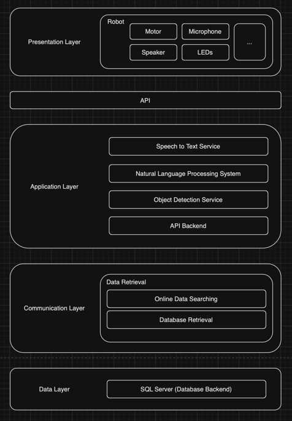

# IT Project Report Skeleton

### Design Graph Link
    https://unimelbcloud-my.sharepoint.com/:u:/g/personal/peihongl_student_unimelb_edu_au/Ee1CcKK7F25OvqqulfCpuGEBpLTNOVXbd5Po1QQnEMrUHg

### IDK what else to put here... (maybe shared word document?)

### 1. **System Architecture Overview**

The System Architecture Overview provides a high-level view of the entire system, explaining how each component fits together and interacts within the "Wise Sage Robot" project.

#### **Components to Include:**

1. **Architecture Diagram**:
   - **Hardware Layer**: 
     - NAO H25 V6 robot, highlighting key hardware components such as cameras, microphones, tactile sensors, and actuators (motors).
   - **Software Control Layer**:
     - Operating system and middleware that manage robot hardware.
     - Control software modules responsible for motion control, sensor data processing, and communications.
   - **Communication Interfaces**:
     - Details on how the robot connects to external systems, such as Wi-Fi, Ethernet, or Bluetooth.
     - Data flow between the robot and any cloud-based services or external databases.
   - **User Interaction Layer**:
     - Components for voice recognition, image processing, and user input handling.
     - Interface through which users interact with the robot, including the special glasses.
   - **Data Processing and Storage Layer**:
     - Local storage on the robot for temporary data caching.
     - Remote storage (e.g., cloud or external database) for persistent data, such as user interaction history and the wisdom database.

2. **Component Relationships**:
   - Describe how each component within the architecture interacts.
   - Define the flow of information between hardware components (e.g., how sensor data is transmitted to the processing units).
   - Explain the interaction between software layers (e.g., how the speech recognition module communicates with the dialogue generation module).

3. **Data Flow Diagram**:
   - **User Input to Response Flow**: Diagram showing how user input (voice, objects) is processed from the moment it is detected by the robot's sensors until a response is generated and delivered (e.g., audio output or gesture).
   - **NAO to Cloud Flow**: Outline how data that needs to be processed or stored in the cloud is transmitted, processed, and retrieved.

4. **Subsystem Overview**:
   - Brief descriptions of major subsystems (e.g., movement control, audio processing, visual recognition) and their roles within the architecture.
   - Explanation of how these subsystems integrate to create the overall system behavior.

### 2. **Component Design Document**

The Component Design Document offers a detailed breakdown of each system component, including its functionality, design, and implementation.

#### **Components to Include:**

1. **Hardware Components**:
   - **NAO H25 V6 Robot**:
     - **Cameras**: Specifications and roles of the front and rear cameras; how they are used for object recognition and user interaction.
     - **Microphones**: Directional microphones for capturing voice input, including noise reduction techniques.
     - **Tactile Sensors**: Placement and purpose of tactile sensors, such as detecting user touches on the head or arms.
     - **Actuators**: Details of the actuators that control the robot’s movement, including joint motors for head, arms, and other relevant parts.

2. **Software Components**:
   - **Motion Control Module**:
     - **Action Planning**: Algorithms and pre-defined sequences for generating and executing movements (e.g., nodding, hand gestures).
     - **Motor Control**: API details for controlling robot’s joints and executing planned movements.
   - **Speech Recognition Module**:
     - **Keyword Detection**: Techniques for recognizing specific keywords in user speech that trigger responses.
     - **Natural Language Processing (NLP)**: Integration of NLP tools to parse and understand user queries.
   - **Image Processing Module**:
     - **Special Glasses Recognition**: Algorithms for detecting and identifying the special glasses worn by users.
     - **Object Recognition**: Processes for identifying objects presented by users and linking them to relevant knowledge in the database.
   - **Dialogue Generation Module**:
     - **Dialogue Framework**: Structure for managing conversational state and context to maintain coherence in interactions.
     - **Text-to-Speech (TTS)**: Description of the TTS engine used for converting generated text into speech output.
   - **User Interaction Module**:
     - **Interaction Trigger**: How interactions are initiated when a user wearing the special glasses enters the robot’s field of view.
     - **Feedback Mechanisms**: Methods for providing visual or auditory feedback to users during interaction.

3. **Integration Components**:
   - **Data Handling**:
     - **Data Flow**: How data flows between different components, such as from sensors to processing units and then to output modules.
     - **Data Buffering**: How temporary data (e.g., sensor readings) is buffered for real-time processing.
   - **Middleware**:
     - **API Definitions**: Details of middleware APIs that facilitate communication between hardware and software components.

4. **User Interaction Design**:
   - **Interaction Flow**: Detailed design of the user interaction flow, from the moment a user approaches to the delivery of responses.
   - **Error Handling**: Design considerations for handling scenarios where user input is unclear or unrecognized.

## 3. Data Architecture Document

### Overview
Our Data Architecture Document provides a clear understanding of how data might be structured, stored, and processed within the "Wise Sage Robot" system. This document aims to ensure that our robot can effectively manage user interactions and knowledge, all while striving to maintain a smooth and secure experience.

### Data Storage

#### Local Storage

1. **Temporary Caching:**
   - **Redis**: 
     - Redis could be used to help us manage real-time interaction data, such as session details and sensor readings, by storing it temporarily in memory. This approach ensures that our robot can quickly access and process the information it needs during interactions.
     - We might set up Redis to start automatically with the robot and use it to store and retrieve data efficiently during each session.

2. **Log Files:**
   - **Logback (Java)** or **Logging (Python)**:
     - Keeping track of our system’s performance, user interactions, and any errors is crucial. We could use Logback or Python’s Logging module to record these logs, ensuring they’re organized and accessible when needed. We would also set up file rotation and compression to manage log file size.

#### Remote Database

1. **User Data:**
   - **MySQL/PostgreSQL**:
     - For storing user-specific information—like interaction history, preferences, and glasses recognition—we might rely on MySQL or PostgreSQL. These databases would allow us to organize and retrieve data efficiently, ensuring that every interaction is personalized and relevant.

2. **Knowledge Database:**
   - **Elasticsearch**:
     - Our knowledge database, potentially built on Elasticsearch, would enable quick retrieval of advice and suggestions on topics such as health and relationships. This database could be structured to support rapid searches, ensuring our robot can provide helpful responses in real-time.

### Data Processing

#### Input Data Processing

1. **Audio Data Pipeline:**
   - **Google Cloud Speech-to-Text API**:
     - We could use Google’s Speech-to-Text API to handle audio inputs. This service would help us capture raw audio, process it, and convert it into text that our robot can understand and respond to.

2. **Image Data Pipeline:**
   - **OpenCV** and **TensorFlow**:
     - Visual inputs, like recognizing special glasses or objects, might be processed using OpenCV and TensorFlow. These tools could help us enhance images and classify objects so our robot can interact with its environment effectively.

#### Output Data Generation

1. **Response Generation:**
   - **Rasa**:
     - To manage conversations, we could use Rasa, a powerful tool that would help our robot understand context and generate appropriate text responses. This would ensure that our interactions feel natural and coherent.

2. **Speech Synthesis:**
   - **Google Text-to-Speech API**:
     - Once we’ve generated the text, it could be converted into speech using Google’s Text-to-Speech API. This approach allows our robot to communicate clearly and naturally with users.

### Data Flow

#### Real-time Data Processing

- **Apache Kafka**:
  - Managing real-time data streams is essential for our system. Apache Kafka might help us handle these data flows efficiently, ensuring that every piece of information is processed promptly, whether it’s user input or background tasks.

#### Data Synchronization

- **MySQL Replication**:
  - To keep our data consistent across local and remote databases, we could use MySQL replication. This setup would ensure that any changes made locally are reflected remotely, keeping everything in sync.

### Data Security and Privacy

#### Encryption

- **OpenSSL**:
  - Protecting sensitive information is a top priority for us. We could use OpenSSL to encrypt data both in transit and at rest, ensuring that user data remains secure throughout its lifecycle.

#### Access Control

- **OAuth 2.0**:
  - We might secure our API interfaces using OAuth 2.0, which would allow us to control who can access system data. This authentication method ensures that only authorized users and components can interact with our system.

### Backup and Recovery

#### Backup Strategy

- **AWS S3 + AWS Backup**:
  - We can potentially use AWS Backup to automate the process. Our backups could be securely stored in AWS S3, ensuring that we are prepared to recover quickly if anything goes wrong.

#### Disaster Recovery

- **Terraform**:
  - In case of hardware failures or other issues, we might rely on Terraform to implement our disaster recovery plan. This tool could help us quickly restore our infrastructure, minimizing downtime and ensuring that our robot is back up and running in no time.

This approach to data architecture aims to help us deliver a robust and secure system for the "Wise Sage Robot," ensuring that our users enjoy a seamless and trustworthy experience.

### 3. **Data Architecture Document**

The Data Architecture Document focuses on how data is structured, stored, and processed within the system, ensuring that the robot can efficiently manage user interactions and knowledge.

#### **Components to Include:**

1. **Data Storage**:
   - **Local Storage**:
     - **Temporary Cache**: Specifications of the temporary cache used for storing real-time interaction data (e.g., current session details, real-time sensor data).
     - **Log Files**: Structure and storage locations for logs that track system performance, user interactions, and errors.
   - **Remote Database**:
     - **User Data**: Schema for storing user-specific data such as interaction history, preferences, and glass identification.
     - **Knowledge Database**: Schema for the wisdom database, including categories of advice (e.g., health, relationships) and associated metadata for fast retrieval.

2. **Data Processing**:
   - **Input Data Processing**:
     - **Audio Data Pipeline**: Steps for processing voice input, from raw audio capture to final text output using speech recognition.
     - **Image Data Pipeline**: Process for handling visual input, including recognition of the special glasses and object classification.
   - **Output Data Generation**:
     - **Response Generation**: How data from the knowledge database is combined with user input to generate appropriate responses.
     - **Speech Synthesis**: Pipeline for converting text responses into synthesized speech for output.

3. **Data Flow**:
   - **Real-Time Data Handling**: How the system manages and prioritizes real-time data (e.g., immediate user inputs vs. background processing tasks).
   - **Data Synchronization**: Mechanisms for synchronizing local data with remote databases, ensuring consistency and reliability.

4. **Data Security and Privacy**:
   - **Encryption**: Methods used to encrypt sensitive data both in transit and at rest, protecting user privacy.
   - **Access Control**: Policies and mechanisms for controlling access to sensitive data, ensuring only authorized entities can access or modify data.

5. **Backup and Recovery**:
   - **Backup Strategy**: Regular backup procedures for critical data, including user interaction history and the knowledge database.
   - **Disaster Recovery**: Plans and protocols for restoring data and system functionality in the event of hardware failure or data corruption.

### 4. **API Design Document**

APIs in this system are primarily used for data exchange between Robots and process backend, and setting states for the robot.

 Architecture Overview</img>

#### **Components to Include:**

1. **Hardware APIs**:
   - **Robot Control API**:
     - **Motor Control**: API endpoints for controlling robot movements, including specifications for motion commands like “nod,” “wave,” or “point.”
     - **Sensor Data Access**: APIs for accessing real-time data from the robot’s sensors (e.g., camera feed, microphone input, tactile sensor states).
   - **Communication API**:
     - **Network Communication**: Endpoints for establishing and maintaining connections between the robot and remote servers or databases.

2. **Software APIs**:
   - **Speech Recognition API**:
     - **Voice Input Handling**: API for passing raw audio data to the speech recognition module and receiving transcribed text.
     - **Keyword Detection**: Endpoints for identifying and reacting to specific keywords within the audio data.
   - **Image Processing API**:
     - **Glasses Recognition**: API for detecting the special glasses and identifying the wearer.
     - **Object Recognition**: API for processing images and identifying objects presented by the user.
   - **Dialogue Generation API**:
     - **Text Response Generation**: API for generating textual responses based on user input and context.
     - **TTS Output**: API for converting text into speech and playing it through the robot’s speakers.

3. **External Integration APIs**:
   - **Knowledge Database API**:
     - **Data Retrieval**: Endpoints for querying the wisdom database and retrieving appropriate advice or sayings based on user input.
     - **Data Ingestion**: API for updating or expanding the wisdom database with new entries.
   - **User Data Management API**:
     - **User Profile Access**: API for retrieving and updating user profiles, including interaction history and preferences.

4. **Error Handling and Logging**:
   - **API Error Codes**: Standardized error codes for handling and diagnosing API failures or unexpected behavior.
   - **Logging API**: API for logging API requests and responses, useful for debugging and performance monitoring.

5. **Security and Authentication**:
   - **API Authentication**: Methods for authenticating API requests, ensuring that only authorized components can interact with the system.
   - **Data Protection**: Strategies for protecting data accessed or

 transmitted through APIs, including encryption and secure tokens.

### 5. **Deployment Architecture Document**

The Deployment Architecture Document outlines the strategies for deploying the system, ensuring it runs efficiently and can be maintained over time.

#### **Components to Include:**

1. **Hardware Deployment**:
   - **NAO Robot Setup**:
     - **Initial Configuration**: Step-by-step guide for setting up the NAO H25 V6 robot, including calibration of sensors and actuators.
     - **Network Configuration**: Instructions for connecting the robot to the local network, including Wi-Fi setup and IP address assignment.
     - **Power Management**: Recommendations for managing the robot’s power supply, including battery maintenance and charging cycles.

2. **Software Deployment**:
   - **Local Software Installation**:
     - **Operating System**: Details on the robot’s operating system setup, including required libraries and dependencies.
     - **Application Software**: Procedures for deploying and configuring the control software, including installation of motion control, speech recognition, and image processing modules.
   - **Remote Server Configuration**:
     - **Cloud Services Setup**: Instructions for setting up cloud services (e.g., AWS, Azure) for data processing, storage, or additional computational tasks.
     - **Database Deployment**: Steps for deploying and configuring the remote database that stores user data and the knowledge database.

3. **CI/CD Pipeline**:
   - **Version Control**:
     - **Repository Setup**: Guidelines for setting up and managing the project’s codebase in a version control system (e.g., Git).
     - **Branching Strategy**: Recommended practices for branching, merging, and version tagging in the development process.
   - **Automated Testing**:
     - **Test Suites**: Descriptions of automated test suites for unit testing, integration testing, and system testing.
     - **Continuous Integration**: Setup of CI tools (e.g., Jenkins, GitHub Actions) to automatically run tests and deploy updates to the robot or remote servers.
   - **Deployment Automation**:
     - **Deployment Scripts**: Scripts for automating the deployment process, reducing manual intervention and ensuring consistency across environments.
     - **Rollback Procedures**: Steps for reverting to previous versions in case of deployment failures or critical issues.

4. **Monitoring and Maintenance**:
   - **System Monitoring**:
     - **Real-Time Monitoring**: Tools and techniques for monitoring the robot’s health, including CPU usage, memory usage, and network connectivity.
     - **Performance Metrics**: Key performance indicators (KPIs) to monitor, such as response time, accuracy of recognition modules, and uptime.
   - **Logging and Analytics**:
     - **Log Management**: Strategies for collecting, storing, and analyzing logs generated by the robot and associated services.
     - **Anomaly Detection**: Methods for detecting and responding to anomalies in the system, such as unexpected behavior or performance degradation.
   - **Software Updates**:
     - **OTA (Over-the-Air) Updates**: Process for deploying software updates remotely, ensuring the robot’s software stays up to date with minimal disruption.
     - **Patch Management**: Procedures for applying patches to fix bugs, security vulnerabilities, or performance issues.

5. **Security and Compliance**:
   - **Security Configurations**:
     - **Firewall Setup**: Guidelines for configuring firewalls and other security measures to protect the robot and associated servers from unauthorized access.
     - **Data Encryption**: Implementation of encryption for data storage and transmission to safeguard sensitive information.
   - **Compliance Standards**:
     - **Data Protection Regulations**: Ensuring compliance with data protection regulations (e.g., GDPR) relevant to user data and interaction logs.
     - **Audit and Reporting**: Setting up processes for regular audits and generating compliance reports to demonstrate adherence to relevant standards.
